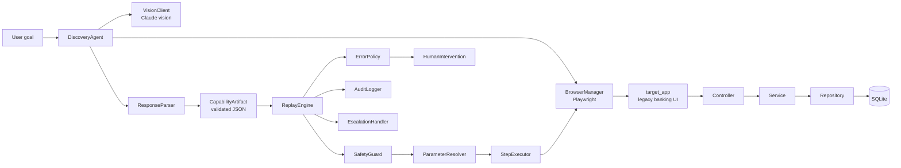

# Computer-Use Automation System

A system that uses an LLM to automate legacy banking applications by:
1. **Discovery:** LLM figures out how to accomplish a goal by interacting with the UI
2. **Recording:** Saves the successful run as a reusable, structured artifact
3. **Replay:** Executes the artifact deterministically without the LLM
4. **Escalation:** Routes to a human operator when stuck
5. **Safety:** Enforces guardrails and handles sensitive data

## Quick Start

### Setup

```bash
# Clone the repo
git clone https://github.com/<your-username>/computer-use-automation.git
cd computer-use-automation

# Create virtual environment
python3 -m venv venv
source venv/bin/activate  # On Windows: venv\Scripts\activate

# Install dependencies
pip install -r requirements.txt

# Set up environment
cp .env.example .env
# Edit .env and add your ANTHROPIC_API_KEY
```

### Run the Agent (Discovery)

```bash
python main.py --goal "Look up member 12345 and read their savings balance" --target "http://localhost:8000"
```

This will:
- Start the mock banking app
- Run the LLM agent against it
- Save the artifact to `artifacts/`

### Replay the Artifact

```bash
python replay.py --artifact artifacts/lookup_member_v1.json --member_id 12345
```

This will:
- Run the saved flow deterministically (no LLM)
- Return the extracted data

## Project Structure

```
.
├── src/
│   ├── agent/           # LLM discovery loop
│   ├── replay/          # Deterministic replay engine
│   ├── artifacts/       # Schema definitions & storage
│   ├── safety/          # Policy enforcement & guardrails
│   ├── escalation/      # Human-in-the-loop
│   └── logging/         # Structured logging
├── target_app/          # Mock banking app (Flask)
├── tests/               # Unit tests
├── evidence/            # Saved runs, logs, screenshots
├── main.py              # Entry point for discovery
├── replay.py            # Entry point for replay
├── README.md            # This file
└── requirements.txt     # Dependencies
```

## Architecture



Discovery uses Claude only to understand the UI and produce a validated
artifact. Replay uses the saved artifact deterministically and does not call
Claude. Safety checks run before browser actions, while failures can pause for
human intervention or create an escalation record.

## Next Steps

See `REPORT.md` for design decisions and architecture.
